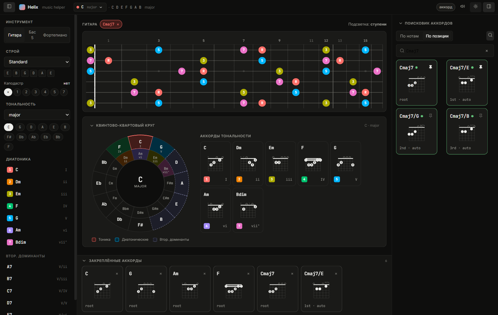

# Helix · Music helper

Личный помощник для сочинения музыки: интерактивный гриф (гитара/бас) и фортепиано, квинто-квартовый круг, диатонические аккорды, поиск аккордов с аппликатурами и звуком. Почти весь код написан агентами (Claude Design → Claude Code).



## Запуск

```bash
npm install
npm run dev        # http://localhost:5173/
```

Если localhost не открывается (IPv6-loopback): `npm run dev -- --host 127.0.0.1`.

Прод-сборка: `npm run build` → `dist/`.

## Стек

Vite · React 18 · zustand · soundfont-player. Без TypeScript, без бэкенда.

Подробнее: [REQUIREMENTS.md](REQUIREMENTS.md) (видение и статус фич), [CLAUDE.md](CLAUDE.md) (инструкции для агента).
